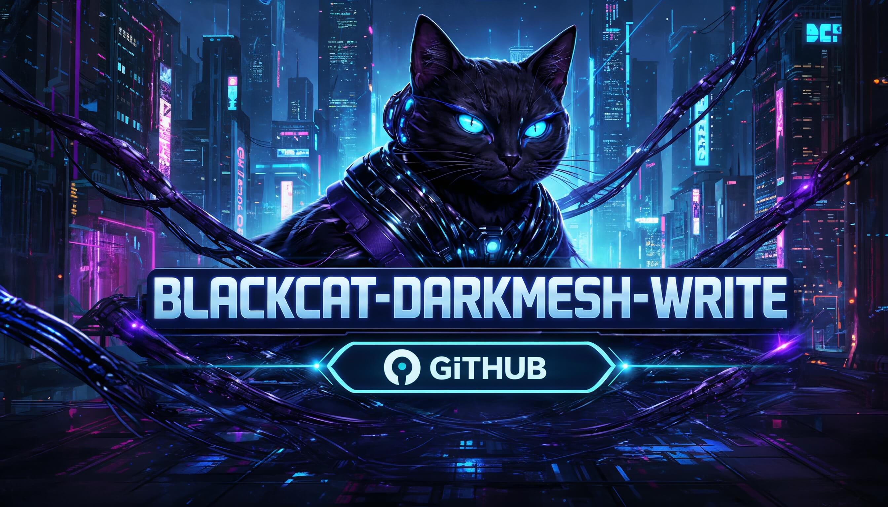
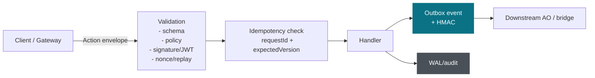
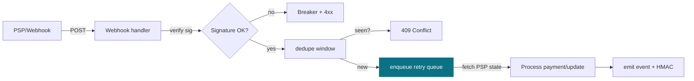

# **blackcat-darkmesh-write**
[](https://github.com/users/Vito416/projects/2) [](https://github.com/Vito416/blackcat-darkmesh-write/actions/workflows/ci.yml)  



AO-native command layer for Blackcat Darkmesh. This repository hosts the write-side AO processes that enforce idempotent, authorized, and auditable changes to the canonical state maintained in `blackcat-darkmesh-ao`. No separate server-side authority exists; any bridge or admin client is only a transport adapter.

> This repo is infrastructure/back-end only: no UI assets, no public read path, no long-lived secrets.

## Contents
- [Scope](#scope)
- [Architecture Snapshot](#architecture-snapshot)
- [Interfaces at a glance](#interfaces-at-a-glance)
- [Links hub](#links-hub)
- [AO deploy (current runbook)](#ao-deploy-current-runbook)
- [Release gate / deep test](#release-gate--deep-test)
- [Development](#development)
- [Env toggles (write process)](#env-toggles-write-process)
- [CLI helpers](#cli-helpers)
- [Prod hardening checklist](#prod-hardening-checklist)
- [Monitoring](#monitoring)
- [Bridge (stub)](#bridge-stub)
- [Security Guard Rails](#security-guard-rails)
- [License](#license)
- [CI notes](#ci-notes)
- [Docker quickstart](#docker-quickstart)

## Scope
- In scope: AO command processes, handlers, idempotency registry, audit/event emission, publish workflow (draft → review → publish → rollback), validators and schemas, minimal adapters, deploy/verify scripts, fixtures, CI workflows.
- Out of scope: public read/state model (lives in `blackcat-darkmesh-ao`), gateway rendering, frontend assets, mailbox payload storage, SMTP/OTP/PSP integrations, template/catalog UI, or long-term secret storage (only public keys here).

## Architecture Snapshot
- Role: command-first AO process set that owns write semantics, conflict detection, and append-only audit; delegates state materialization to `blackcat-darkmesh-ao`.
- Pipeline: command envelope → validation (schema + policy) → idempotency / anti-replay → handler → audit + event → downstream AO state update.
- Identity & auth: signed commands or capability tokens; gateway is never an implicit authority.
- Idempotence: `requestId` registry and optimistic `expectedVersion` guards to prevent duplicate writes.
- Audit: append-only log with correlation to requestId and actor; deterministic status codes.
- Gateway compatibility: `CreateOrder` supports both cart-driven payloads
  (`cartId`) and direct template payloads (`siteId + items`) with safe
  `orderId`/`currency` fallback generation.





Legend: teal = queues/events, gray = WAL/audit paths.

### Interfaces at a glance

| Area | Inputs | Outputs | Interfaces / Paths | Health | CI gates |
|---|---|---|---|---|---|
| Commands | Signed envelopes (`Action`, `Request-Id`, `Actor`, `Tenant`, `Expected-Version`, `Nonce`, `Signature-Ref`, `Timestamp`) | WAL entries, outbox events (HMACed), audit | `ao/write/process.lua`, schemas under `schemas/` | `scripts/verify/health.lua` | `preflight`, `contracts`, `conflicts`, `batch fixtures` |
| Webhooks (PSP) | Stripe/PayPal/GoPay webhook POSTs + signatures | PSP events → outbox, breaker state, retry queue | `ao/shared/psp_webhooks.lua`, retry queue | metrics `webhook_retry_*`, `breaker_open` | `webhook_psp_spec`, `gopay_webhook_spec` |
| Metrics | Prom text file (`METRICS_PROM_PATH`) | scrape/alerts | `/metrics` (if exposed) | `scripts/verify/health.lua` | `docs/ALERTS.md` |
| Arweave gate | Artifact hash vs TX | pass/fail | `scripts/verify/verify_arweave_hash.sh` | n/a | `ENFORCE_ARWEAVE_HASH` stage |

## Links hub
- Alerts & thresholds: `docs/ALERTS.md`
- Deploy runbook: `docs/runbooks/deploy.md`
- Rollback runbook (incl. hash-gate handling): `docs/runbooks/rollback.md`
- Env template: `ops/env.prod.example`
- Schemas: `schemas/`
- PSP/webhook specs: `scripts/verify/webhook_psp_spec.lua`, `gopay_webhook_spec.lua`

## AO deploy (current runbook)
- Canonical endpoint: `https://push.forward.computer`
- Scheduler: `n_XZJhUnmldNFo4dhajoPZWhBXuJk-OcQr5JQ49c4Zo`
- Runtime variant/tag family: `ao.TN.1` (module + process + message path in this repo)
- Source of truth for live module/PID history: `AO_DEPLOY_NOTES.md` (do not treat this README as the TX ledger).

### Publish module (WASM)
```bash
node scripts/build-write-bundle.js
ao-dev build
node scripts/publish-wasm.js
```

`scripts/publish-wasm.js` publishes `dist/write/process.wasm` with the expected tags:
- `Type=Module`
- `Content-Type=application/wasm`
- `Variant=ao.TN.1`
- `signing-format=ans104`
- `accept-bundle=true`
- `accept-codec=httpsig@1.0`

### Spawn process
```bash
AO_MODULE=<module_tx> \
HB_URL=https://push.forward.computer \
HB_SCHEDULER=n_XZJhUnmldNFo4dhajoPZWhBXuJk-OcQr5JQ49c4Zo \
WRITE_SIG_TYPE=ed25519 \
WRITE_SIG_PUBLIC=<pubkey_or_hex> \
node scripts/cli/spawn_wasm_tn.js
```

### Finalization gate (required)
- Expect temporary `404` on `https://arweave.net/raw/<tx>` shortly after publish/spawn.
- Do not trust runtime behavior before both module and PID are indexed/finalized.
- Typical observed delay in this project: initial 404 window + extended finalization (often tens of minutes).

### Deep test entrypoints
```bash
HB_URL=https://push.forward.computer \
HB_SCHEDULER=n_XZJhUnmldNFo4dhajoPZWhBXuJk-OcQr5JQ49c4Zo \
AO_PID=<pid> \
node scripts/cli/diagnose_message.js

HB_URL=https://push.forward.computer \
HB_SCHEDULER=n_XZJhUnmldNFo4dhajoPZWhBXuJk-OcQr5JQ49c4Zo \
AO_PID=<pid> \
node scripts/cli/send_write_command.js
```

For worker-signed end-to-end tests, set `WORKER_SIGN_URL` + `WORKER_AUTH_TOKEN` (test values are kept locally in `tmp/test-secrets.json`).

### HTTP checkout adapter (for PHP/bridge mode)

Gateway template contract expects write endpoints:
- `POST /api/checkout/order`
- `POST /api/checkout/payment-intent`

This repo now ships a lightweight adapter:

```bash
WRITE_PROCESS_ID=<write_pid> \
WRITE_WALLET_PATH=wallet.json \
WRITE_HB_URL=https://push.forward.computer \
WRITE_HB_SCHEDULER=n_XZJhUnmldNFo4dhajoPZWhBXuJk-OcQr5JQ49c4Zo \
WRITE_SIGNER_URL=https://<worker-host>/sign \
WRITE_SIGNER_TOKEN=<worker_bearer_token> \
node scripts/http/checkout_api_server.mjs
```

Notes:
- Adapter accepts already signed envelopes, or can call worker `/sign` when signature fields are missing.
- It forwards envelope as `Write-Command` AO message and returns normalized write result.
- Default listen address is `0.0.0.0:8789` (`PORT` can override).
- Optional multi-site PID override is disabled by default. To enable safely, set both `WRITE_API_ALLOW_PID_OVERRIDE=1`
  and `WRITE_API_TOKEN`, then pass `X-Write-Process-Id` (or body `writeProcessId`) per request.

### Release gate / deep test
Run the v1.2.0 readiness gate in one command:
```bash
AO_PID=<pid> \
HB_URLS=https://push.forward.computer,https://push-1.forward.computer \
AO_SECRETS_PATH=tmp/test-secrets.json \
scripts/verify/release_gate_v120.sh --strict
```

Flag form:
```bash
scripts/verify/release_gate_v120.sh \
  --pid <pid> \
  --urls https://push.forward.computer,https://push-1.forward.computer \
  --secrets tmp/test-secrets.json \
  --strict
```

- The gate runs preflight, luacheck, stylua, the core write smokes, and AO deep checks in a fixed order.
- Without `--strict`, it still requires the send and primary readback probes to pass.
- `--strict` extends CU readback assertions to every URL you pass.

## Repository Layout (blueprint)
```
docs/              # command contracts, flows, failure modes, ADRs, runbooks
ao/                # AO command process and shared libs
  write/           # command handlers, routing
  shared/          # auth, idempotency, validation, audit
schemas/           # JSON schemas for command envelopes and actions
scripts/           # deploy | verify
fixtures/          # sample command envelopes and expected outcomes
tests/             # contract, conflict, and security tests
scripts/bridge/    # stub forwarder from write outbox to -ao
scripts/cli/       # local helpers (run command)
.github/workflows/ # CI entrypoint
```

## Minimal Command Envelope
- Required tags: `Action`, `Request-Id`, `Actor`, `Tenant`, `Expected-Version`, `Nonce`, `Signature-Ref`, `Timestamp`.
- Core handlers (initial set): `SaveDraftPage`, `PublishPageVersion`, `UpsertRoute`, `UpsertProduct`, `UpsertProfile`, `AssignRole`, `GrantEntitlement`, `CreateOrder`, `CreatePaymentIntent`, `ConfirmPayment`.
- Conflict strategy: reject on missing/expired nonce, replayed `Request-Id`, or mismatched `Expected-Version`; return prior result when replayed.

## Development
- Prereqs: `lua5.4` (or `luac`) and `python3`.
- Static checks: `scripts/verify/preflight.sh` (JSON schema validation + Lua syntax).
- Contract smoke tests: `LUA_PATH="?.lua;?/init.lua;ao/?.lua;ao/?/init.lua" lua5.4 scripts/verify/contracts.lua` (or set `RUN_CONTRACTS=1` to run during preflight).
- Conflict/security smoke tests: `LUA_PATH="?.lua;?/init.lua;ao/?.lua;ao/?/init.lua" lua5.4 scripts/verify/conflicts.lua` (or `RUN_CONFLICTS=1`).
- Batch fixtures: `LUA_PATH="?.lua;?/init.lua;ao/?.lua;ao/?/init.lua" lua5.4 scripts/cli/batch_run.lua` (or `RUN_BATCH=1` in preflight) – compares fixtures to `*.expected.json`.
- Branches: `main` (releasable), `develop` (integration), `feature/*`, `adr/*`, `release/*`.
- Message contracts and schemas are public API; prefer additive changes over breaking ones.

### Quickstart (local dev)
1) Install deps: `sudo apt-get install lua5.4 lua5.4-dev luarocks libsodium-dev`  
   then install rocks from the lockfile:
   ```bash
   while read -r name ver; do
     case "$name" in \#*|"") continue ;;
     esac
     luarocks --lua-version=5.4 install --local "$name" "$ver"
   done < ops/rocks.lock
   ```
2) Copy env template: `cp ops/env.prod.example ops/.env.local` and fill secrets:  
   - `OUTBOX_HMAC_SECRET` (required)  
   - signature verifier (`WRITE_SIG_PUBLIC` or `WRITE_SIG_SECRET` when `WRITE_SIG_TYPE=hmac`)  
   - optional `WRITE_JWT_HS_SECRET` if you turn on `WRITE_REQUIRE_JWT=1`.
3) Run checks: `RUN_DEPS_CHECK=1 LUA_PATH="?.lua;?/init.lua;ao/?.lua;ao/?/init.lua" LUA_CPATH="$HOME/.luarocks/lib/lua/5.4/?.so" scripts/verify/preflight.sh` (or `make preflight RUN_DEPS_CHECK=1`).
4) Fixtures: `RUN_BATCH=1 LUA_PATH="?.lua;?/init.lua;ao/?.lua;ao/?/init.lua" lua scripts/cli/batch_run.lua` (uses the env from step 2; hashes/nonce/signature checks can be relaxed via `WRITE_REQUIRE_*` env).
5) Outbox/queue paths in the template default to `/var/lib/ao/...`; for dev you can override to `dev/*` paths next to the repo.
6) Optional specs:  
   - JWT: `RUN_JWT_SPEC=1 lua5.4 scripts/verify/jwt_actor_spec.lua` + `scripts/verify/jwt_expiry_spec.lua`  
   - Rate/nonce: `RUN_RATE_SPEC=1 WRITE_RATE_STORE_PATH=dev/write-rate-store.json lua5.4 scripts/verify/rate_store_spec.lua`; `RUN_RATE_SPEC=1 lua5.4 scripts/verify/rate_tenant_scope_spec.lua`  
   - Outbox HMAC: `RUN_OUTBOX_SPEC=1 lua5.4 scripts/verify/outbox_hmac_spec.lua`

## Env toggles (write process)
- `WRITE_REQUIRE_SIGNATURE=1` — reject commands without `signatureRef`.
- `WRITE_REQUIRE_NONCE=1` — reject commands without nonce and block replay.
- `WRITE_NONCE_TTL_SECONDS` (default 300) and `WRITE_NONCE_MAX` (default 2048) — nonce cache sizing.
- `WRITE_ALLOW_ANON=1` — allow missing actor/tenant (off by default).
- `WRITE_SIG_TYPE=ed25519|ecdsa|hmac` (prod default: `ed25519`).
- Signature verification inputs:
  - `WRITE_SIG_PUBLIC` (single key; PEM path or `hex:<pubkey>` form),
  - `WRITE_SIG_PUBLICS` (rotation/keyring map keyed by `signatureRef`, supports `default`),
  - `WRITE_SIG_SECRET` (for `hmac` mode).
- SignatureRef policy gate:
  - `WRITE_SIGNATURE_POLICY_JSON` or `WRITE_SIGNATURE_POLICY_PATH` (JSON map keyed by `signatureRef` with per-key `actions` and optional `roles`; unknown or missing refs fail closed with deterministic `signature_policy_*` errors),
  - policy is enforced after signature verification and before the existing role checks.
- `WRITE_ROLE_POLICY_STRICT=1` — fail closed when an action has no role-policy entry (`role_policy_missing_action`).
- Optional JWT gate: set `WRITE_JWT_HS_SECRET` (HS256) and optionally `WRITE_REQUIRE_JWT=1` to fail-closed; claims `sub/tenant/role/nonce` populate `actor/tenant/role/nonce` when missing.
- `WRITE_WAL_PATH=/var/lib/ao/write-wal.ndjson` — append-only WAL with request/response hashes.
- `WRITE_IDEM_PATH=/var/lib/ao/write-idem.json` — persist idempotent responses across restarts (optional).
- `WRITE_OUTBOX_PATH=/var/lib/ao/write-outbox.json` — persist outbox events (used by forwarders/export).
- Checksum watchdog: `ops/systemd/write-checksum.service` + `scripts/verify/checksum_daemon.sh` (set `WRITE_WAL_PATH`, `WRITE_OUTBOX_PATH`, `CHECKSUM_INTERVAL_SEC`).
- Resolver flags: `WRITE_FLAGS_PATH=/etc/ao/resolver-flags.ndjson` to block/readonly resolvers (shared with registry/AO); enforced before policy.
- Shipping/Tax export for AO: persist rates with `WRITE_RATE_STORE_PATH` and run `scripts/export/rates.lua [rate_store] [shipping.ndjson] [tax.ndjson]`; point AO to the outputs via `AO_SHIPPING_RATES_PATH` / `AO_TAX_RATES_PATH`.
- Dispute evidence payload: `AddDisputeEvidence` accepts `evidence.url|hash|hashAlgo|type|note|fileName` to carry provider links/hashes; stored in `payment_disputes` and can be sent via provider webhooks.
- `WRITE_RL_WINDOW_SECONDS` / `WRITE_RL_MAX_REQUESTS` — rate-limit per tenant+actor (default 60s / 200 reqs).
- `WRITE_RL_BUCKET_TTL_SECONDS` / `WRITE_RL_MAX_BUCKETS` — trim idle buckets (default 4× window, 4096 buckets).
- `WRITE_RATE_STORE_PATH` — persist rate-limit buckets across restarts (optional; JSON file written atomically).
- `WRITE_NONCE_STORE_PATH` — persist nonce cache (tenant+actor namespaced) to survive restarts.
- Bridge/env for queue/HTTP: `AO_ENDPOINT=https://...` (optional); `AO_API_KEY`; `DRY_RUN=1` or `AO_BRIDGE_MODE=mock|off|http`; `AO_BRIDGE_RETRIES`/`AO_BRIDGE_BACKOFF_MS`; `AO_QUEUE_PATH` (persisted queue), `AO_QUEUE_LOG_PATH=/var/lib/ao/queue-log.ndjson`, `AO_QUEUE_MAX_RETRIES=5`, `AO_EXPECT_RESPONSE_HASH` to enforce downstream body hash.
- PSP webhook hardening: set `STRIPE_WEBHOOK_SECRET` (32-byte secret from Stripe), `PAYPAL_WEBHOOK_STRICT=1` to require PayPal signatures, tune replay cache with `WRITE_WEBHOOK_REPLAY_WINDOW` / `WRITE_WEBHOOK_SEEN_TTL` (and optional `WRITE_WEBHOOK_SEEN_MAX`), and cap backlog with `WRITE_WEBHOOK_RETRY_MAX_QUEUE` alongside the existing `WRITE_WEBHOOK_RETRY_*` knobs.
- Outbox HMAC enforcement: `WRITE_STRICT_OUTBOX_HMAC=1` rejects outbox events without `hmac` when `OUTBOX_HMAC_SECRET` is set (default off; forwarder still checks mismatches when `hmac` is present). HMAC input defaults to full canonical JSON of the event; set `WRITE_OUTBOX_HMAC_MODE=legacy` to use the older limited field hash.
- Trust manifest signing (resolvers): set `TRUST_MANIFEST_HMAC` and run `lua scripts/cli/trust_manifest_sign.lua manifest.json > manifest.signed.json`; optionally set `TRUST_MANIFEST_SIGNER`.
- Key management: keep public keys under `/etc/ao/keys`, record their `sha256sum` in ops docs, rotate on a schedule; never store private keys in repos, artifacts, or CI logs.
- OTP/passwordless flows and payment/PSP callbacks have been removed from this repo; keep secrets and such logic in upstream gateway/web layers.

## Docker quickstart
```bash
docker compose build
docker compose run --rm write         # runs full preflight (schemas, contracts, conflicts, batch)
docker compose run --rm write bash    # drop into shell with deps preinstalled
```
Notes: the image ships with Lua openssl + luasodium so PSP/webhook specs run with crypto enabled. `outbox replay smoke` will print `hmac failures: missing=1` if `OUTBOX_HMAC_SECRET` is unset; set it to silence that warning.

## CLI helpers
- `lua scripts/cli/run_command.lua ./fixtures/sample-save-draft.json` — route a JSON command locally and print the response (uses in-memory state). A publish sample is at `fixtures/sample-publish.json`.
- `RUN_BATCH=1 LUA_PATH="?.lua;?/init.lua;ao/?.lua;ao/?/init.lua" lua scripts/cli/batch_run.lua` — run all fixtures and enforce matches to `*.expected.json` (CI uses this).
- Queue forwarder (persisted outbox → HTTP):  
  `AO_QUEUE_PATH=dev/outbox-queue.ndjson AO_QUEUE_LOG_PATH=dev/queue-log.ndjson AO_QUEUE_MAX_RETRIES=5 LUA_PATH="?.lua;?/init.lua;ao/?.lua;ao/?/init.lua" lua scripts/bridge/queue_forward.lua`
- Outbox replay into a fresh queue (with HMAC verify):  
  `OUTBOX_HMAC_SECRET=dev-secret WRITE_OUTBOX_PATH=dev/outbox.json AO_QUEUE_PATH=dev/outbox-queue.ndjson lua scripts/worker/outbox_replay.lua`
- Health snapshot (write-side files & deps):  
  `WRITE_WAL_PATH=... WRITE_OUTBOX_PATH=... AO_QUEUE_PATH=... LUA_PATH="?.lua;?/init.lua;ao/?.lua;ao/?/init.lua" lua scripts/verify/health.lua`
- Export verifier (PII scrub check):  
  `WRITE_OUTBOX_EXPORT_PATH=dev/outbox.ndjson lua scripts/verify/export_verify.lua`

## Prod hardening checklist
> 🚦 **Production readiness** — keep these on before serving real traffic.
- Set `WRITE_STRICT_OUTBOX_HMAC=1` and ensure every emitted event includes `hmac`.
- Keep signature/JWT verification on (WRITE_REQUIRE_SIGNATURE/WRITE_REQUIRE_JWT) and rotate keys regularly.
- Persist idempotency/rate buckets/outbox where applicable (`WRITE_IDEM_PATH`, `WRITE_RATE_STORE_PATH`, `WRITE_OUTBOX_PATH`) and back them up.
- Monitor `/metrics` (bearer from METRICS_BEARER_TOKEN) for `rate_limited`, `replay_nonce`, and outbox HMAC counters; alert on sustained errors.
- If Arweave verification is mandatory on all branches, set `ENFORCE_ARWEAVE_HASH=1` and provide `ARWEAVE_VERIFY_FILE/ARWEAVE_VERIFY_TX`; CI will fail-closed otherwise.
- Licensing quick links: BFNL-1.0 and Founder Fee Policy are authoritative — keep deployments within their terms.

> **Common pitfalls**
> - `OUTBOX_HMAC_SECRET` must be 64 hex chars (32B) or HMAC drifts and `secrets_lint` will fail.
> - `WRITE_SIG_TYPE` must match the key you provide (public key for ed25519/ecdsa vs shared secret for hmac).
> - `WRITE_NONCE_TTL_SECONDS` / replay window: too low → false rejects; too high → oversized seen-cache.
> - Arweave hash gate: with `ENFORCE_ARWEAVE_HASH=1` you need the correct `ARWEAVE_VERIFY_TX` + artifact, otherwise CI fails closed.

## Monitoring
- Expose Prom-style `/metrics` via `ao.shared.metrics` (see `METRICS_PROM_PATH`, `METRICS_LOG`, `METRICS_BEARER_TOKEN`).
- Key counters:
  - `outbox_queue_depth`, `write.outbox.queue_size`
  - `write_auth_signature_failed_total`, `write_auth_signature_missing_total`
  - `write_auth_jwt_invalid_total`, `write_auth_jwt_expired_total`, `write_auth_jwt_not_before_total`, `write_auth_jwt_skew_total`, `write_auth_jwt_*_mismatch_total`
  - `write_auth_nonce_replay_total`
  - `write_auth_rate_limited_total`
  - `write.idempotency.collisions`, `idempotency_collisions_total`
  - `write.webhook.retry_queue`, `webhook_retry_queue`, `write.webhook.retry_lag_seconds`, `webhook_retry_lag_seconds`, `webhook_retry_overdue`
  - `write.psp.breaker_open`, `breaker_open`
  - `write.wal.apply_duration_seconds`, `wal_apply_duration_seconds`
  - `write_outbox_hmac_missing_total`, `write_outbox_hmac_mismatch_total`
- Sample alerts (PromQL):
  - `increase(write_auth_rate_limited_total[5m]) > 50`
  - `increase(write_auth_jwt_invalid_total[5m]) > 5 or increase(write_auth_jwt_expired_total[5m]) > 20`
  - `increase(write_auth_nonce_replay_total[5m]) > 0`
  - `increase(write_outbox_hmac_mismatch_total[5m]) > 0 or increase(write_outbox_hmac_missing_total[5m]) > 5`
  - `max_over_time(outbox_queue_depth[5m]) > 100 or increase(webhook_retry_queue[5m]) > 20`
  - `increase(breaker_open[5m]) > 0`
- Add alerts on rising trends; log/Prom output controlled by `METRICS_*` envs in `ao/shared/metrics.lua`.
- More alert examples: `docs/ALERTS.md`.

## Bridge (stub)
- `scripts/bridge/forward_outbox.lua` reads the in-memory outbox (`write._storage_outbox()`) and logs events you would forward to `blackcat-darkmesh-ao`. Replace `forward_event` with signed POST to AO endpoint (registry/site process) in production.
- `scripts/bridge/export_outbox.lua [outfile]` dumps outbox to NDJSON (default `dev/outbox.ndjson`) for offline inspection or manual upload.
- `scripts/bridge/forward_outbox_http.lua` posts outbox events to `AO_ENDPOINT` (set `DRY_RUN=1` to log only; optional `AO_API_KEY`, `AO_SITE_ID` tag).

## Security Guard Rails
- No secrets or raw keys in AO state, manifests, or adapters.
- Gateways act only as clients; write process re-validates auth and policy.
- All comments and docs remain in English.

## License
Blackcat Darkmesh Write is licensed under `BFNL-1.0` (see `LICENSE`). Contribution and relicensing rules are governed by the companion documents in `blackcat-darkmesh-ao/docs/`. This repository is an official component of the Blackcat Covered System; the repo split inside `BLACKCAT_MESH_NEXUS` is only for maintenance/safety/auditability and does **not** trigger a separate fee event for the same deployment.

Canonical licensing bundle:
- BFNL 1.0: https://github.com/Vito416/blackcat-darkmesh-ao/blob/main/docs/BFNL-1.0.md
- Founder Fee Policy: https://github.com/Vito416/blackcat-darkmesh-ao/blob/main/docs/FEE_POLICY.md
- Covered-System Notice: https://github.com/Vito416/blackcat-darkmesh-ao/blob/main/docs/LICENSING_SYSTEM_NOTICE.md

## CI notes
- CI currently runs schema/lua/stylua checks, ingest/envelope/action validation, publish/idempotency/conflict/hmac smokes, and Arweave/hash gates (based on env flags).
- If `scripts/sign-write.js` is used in verify scripts, Node dependencies must be installed (`npm ci` step is required in CI).
